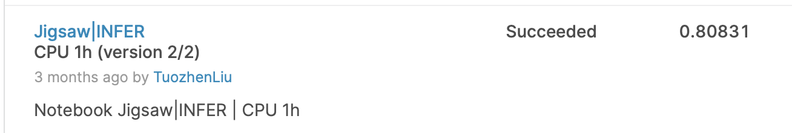

# Jigsaw Rate Severity of Toxic Comments

https://www.kaggle.com/c/jigsaw-toxic-severity-rating/submissions

Private Leaderboard: 0.80831(23/2302)

## RoBERTa fine-tuning V0

- Modified Training Pairs
  - 1:10 (1:5 hard neg samples)
- 10 folds
- 3 epochs -> best
- 64 batch_size
- Adafactor
  - eps=(1e-30, 1e-3)
  - clip_threshold=1.0
  - decay_rate=-0.8
  - weight_decay=1e-6
  - relative_step=False        
  - scale_parameter=True
  - warmup_init=False 
- lr 3e-4 -> 1e-5 
  - T_max 3000 
  - CosineAnnealingLR

-   eval & save interval 1000 

## Ensemble [TFIDF+RoBERTa]

Input files:

- ../input/jigsaw-toxic-severity-rating - current competition data
- ../input/jigsaw-toxic-comment-classification-challenge - 2017 competition data "The problem of classification of toxic comments"
- ../input/roberta-base - model data roberta base [for tokenizer]
- ../input/ruddit-jigsaw-dataset - Norms of Offensiveness for English Reddit Comments is a dataset of English language Reddit comments
- Roberta checkpoint

### TFIDF

- [TF-IDF+NB](https://www.kaggle.com/julian3833/jigsaw-incredibly-simple-naive-bayes-0-768)
  - Data1: jigsaw-toxic-comment-classification-challenge
  - Validation(2021 data) `0.664`
  -  LB `0.768`

- [Ensemble RidgeRegression](https://www.kaggle.com/steubk/jrsotc-ridgeregression-ensemble-of-3)
  - Data1: jigsaw-toxic-comment-classification-challenge
    - Validation(2021 data) :`0.684`
  - Data2: jigsaw-unintended-bias-in-toxicity-classification
    - Validation(2021 data): `0.684`
  - Data3: ruddit-jigsaw-dataset
    - Validation(2021 data): `0.647`
  - Ensemble 
    - Validation(2021 data) `0.692`
    - LB `0.830`

`notes:` why not save sklearn model? can save about 1 hour for submission--> [sklearn joblib](https://www.cnblogs.com/ceo-python/p/11979978.html)

### RoBERTa

- Train only on 2021 data
  - [train scipt]( https://www.kaggle.com/andrej0marinchenko/my-jigsaw-starter-for-beginners)

- Others' pretrained checkpoint
  - https://www.kaggle.com/leolu1998/robrta-base-10fold
    - https://www.kaggle.com/leolu1998/jigsaw-ensemble-tfidf-bert
  - https://www.kaggle.com/debarshichanda/pytorch-w-b-jigsaw-starter (5-fold)

`notes:` about 30min for 1fold inference

### References

 [[Best Score 0.856] Jigsaw for beginners](https://www.kaggle.com/andrej0marinchenko/best-score-0-856-jigsaw-for-beginners/notebook),  [Jigsaw Ensemble [TFIDF+BERT]](https://www.kaggle.com/leolu1998/jigsaw-ensemble-tfidf-bert)

## Some ideas:

- use mutli loss: rank & score -> toxic
- filter non-english

## Additionals

- [Maybe useful resources:pretrained models and datasets](https://www.kaggle.com/c/jigsaw-toxic-severity-rating/discussion/289413)
- Datasets
  - https://www.kaggle.com/c/jigsaw-toxic-severity-rating/discussion/293328
- Huggingface pretained model
  - https://huggingface.co/SkolkovoInstitute/roberta_toxicity_classifier

